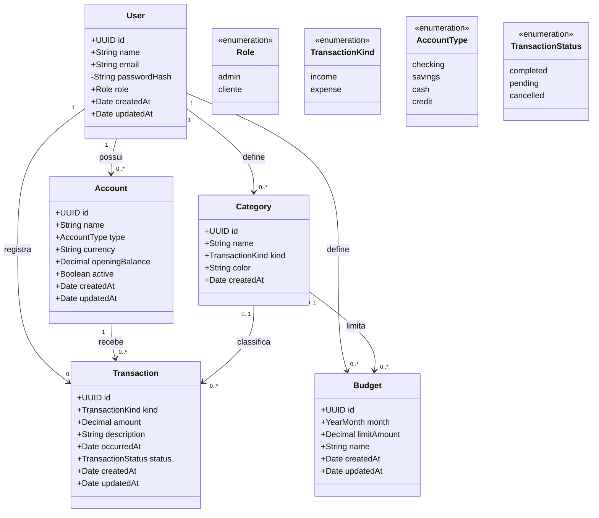
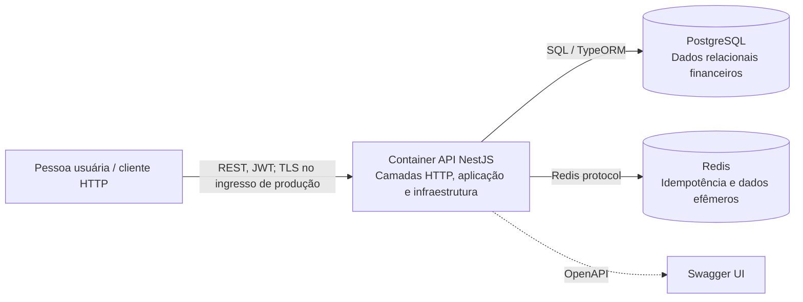
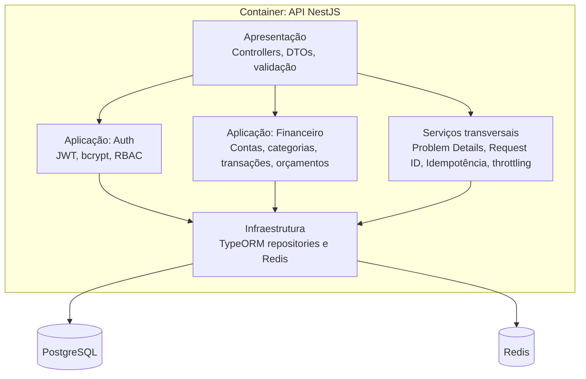

# API de Gestão Financeira

Documentação detalhada do processo de criação, arquitetura C4, componentes, modelo UML e requisitos não funcionais: [`docs/arquitetura-e-processo.md`](docs/arquitetura-e-processo.md).

API REST construída com NestJS, TypeScript, PostgreSQL e Redis. A aplicação organiza a apresentação (controllers/DTOs), a aplicação (serviços e regras de negócio) e a infraestrutura (TypeORM, PostgreSQL e Redis) em módulos por domínio.

## Arquitetura e ferramentas

**Arquitetura escolhida: Arquitetura em Camadas, organizada por módulos de domínio.** A camada de apresentação contém controllers HTTP, DTOs e validação; a camada de aplicação contém os serviços de autenticação e regras dos domínios financeiros; a camada de infraestrutura contém TypeORM, PostgreSQL e Redis. O NestJS faz a composição das dependências e módulos. Essa divisão mantém HTTP, regras de negócio e persistência com responsabilidades distintas, enquanto contas, categorias, transações e orçamentos continuam agrupados por domínio.

| Uso | Ferramenta |
| --- | --- |
| API e módulos | NestJS e TypeScript |
| Mapeamento objeto-relacional | TypeORM |
| Banco relacional e fonte dos dados financeiros | PostgreSQL 16 |
| Idempotência e armazenamento efêmero | Redis 7 |
| Contrato e interface interativa | OpenAPI/Swagger |
| Execução local dos containers | Docker e Docker Compose |

Estrutura principal do código: `src/modules/*` reúne apresentação, aplicação e persistência de cada domínio; `src/common` contém autenticação/autorização, idempotência, correlação de requisições e erros transversais.

## Executar

Requer Docker e Docker Compose. Copie `.env.example` para `.env`, altere os segredos e execute:

```bash
docker compose up --build
```

A API ficará disponível em `http://localhost:3000/api/v1`; Swagger em `http://localhost:3000/docs`; health check em `http://localhost:3000/api/v1/health`.

Para desenvolvimento local, configure as variáveis de `.env.example`, instale dependências com `pnpm install` ou `npm install` e rode `npm run start:dev`. O `docker-compose.yml` sobe também PostgreSQL e Redis.

## Domínios e rotas

| Domínio | Rotas |
| --- | --- |
| Autenticação | `POST /auth/register`, `POST /auth/login` |
| Contas | `GET/POST /accounts`, `DELETE /accounts/:id` |
| Categorias | `GET/POST /categories` |
| Transações | `GET/POST /transactions`, `DELETE /transactions/:id` |
| Orçamentos | `GET/POST /budgets` |

Todas as rotas, exceto registro, login e health, requerem `Authorization: Bearer <JWT>`. Cadastros transacionais (`POST` de contas, categorias, transações e orçamentos) exigem também `Idempotency-Key`, único por usuário e operação. A mesma chave com o mesmo corpo reproduz a resposta durante 24 horas; reutilizar com corpo diferente retorna `409 Conflict`. Cadastro público sempre cria papel `cliente`. O administrador inicial pode ser provisionado definindo `ADMIN_EMAIL` e `ADMIN_PASSWORD` (mínimo de 12 caracteres) antes da primeira inicialização; nenhum endpoint público promove usuários.

`POST /auth/register` e `POST /auth/login` têm limite de 5 requisições por minuto. Há limite global de 100/minuto. Erros usam `application/problem+json` (RFC 7807) e incluem `requestId`; `Correlation-ID` é aceito como identificador de entrada ou gerado pela API, retornado no cabeçalho e registrado em JSON.

## Modelo de dados

O diagrama abaixo é a **modelagem de classes UML**. Os campos monetários são persistidos como `numeric(14,2)` no PostgreSQL; `User.role` contém `admin` ou `cliente`, e `Transaction.kind` / `Category.kind` contêm `income` ou `expense`.



O diagrama entidade-relacionamento correspondente ao banco relacional também está abaixo:

```mermaid
erDiagram
  USERS ||--o{ ACCOUNTS : owns
  USERS ||--o{ CATEGORIES : owns
  USERS ||--o{ TRANSACTIONS : records
  USERS ||--o{ BUDGETS : sets
  ACCOUNTS ||--o{ TRANSACTIONS : contains
  CATEGORIES o|--o{ TRANSACTIONS : classifies
  CATEGORIES o|--o{ BUDGETS : limits
  USERS { uuid id PK; string name; string email UK; string passwordHash; string role }
  ACCOUNTS { uuid id PK; uuid userId FK; string name; string type; char currency; decimal openingBalance }
  CATEGORIES { uuid id PK; uuid userId FK; string name; string kind }
  TRANSACTIONS { uuid id PK; uuid userId FK; uuid accountId FK; uuid categoryId FK; string kind; decimal amount; date occurredAt; string status }
  BUDGETS { uuid id PK; uuid userId FK; uuid categoryId FK; char month; decimal limitAmount }
```

PostgreSQL mantém os registros relacionais e valores monetários em `numeric(14,2)`. Redis armazena respostas/idempotência com expiração de 24h; seus volumes persistem dados conforme configuração AOF. O limitador padrão NestJS é por processo; para produção com múltiplas réplicas, configure armazenamento Redis compartilhado do throttler e considere proxy/API gateway como primeira camada de proteção.

## C4 — Containers



## C4 — Componentes da API



## Configuração e operação

- `DB_SYNCHRONIZE=true` existe apenas para subir o ambiente local inicial. Em produção use `false` e migrações versionadas antes do deploy.
- Altere `JWT_SECRET`, `JWT_REFRESH_SECRET`, senhas de banco e senha inicial do admin. Segredos de exemplo são exclusivamente locais; use um secret manager em nuvem.
- Compose define health checks e volumes persistentes para PostgreSQL e Redis; escale réplicas da API atrás de um balanceador. Para ambiente distribuído, centralize rate limiting em Redis/gateway e encaminhe `Correlation-ID` no balanceador.
- A API está pronta para execução containerizada. Deploy gerenciado, backup/restauração, migrações, alertas e armazenamento distribuído de rate limit devem ser configurados para o provedor cloud escolhido.
