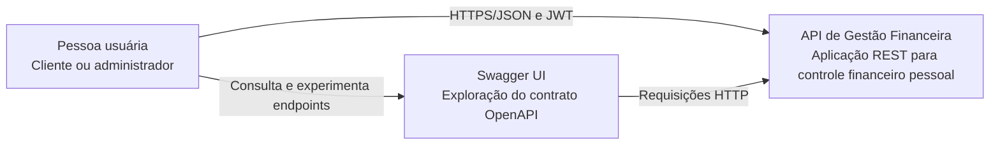
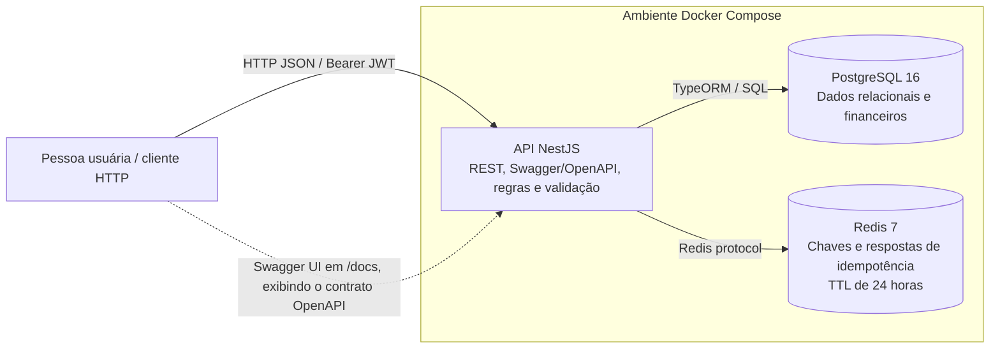
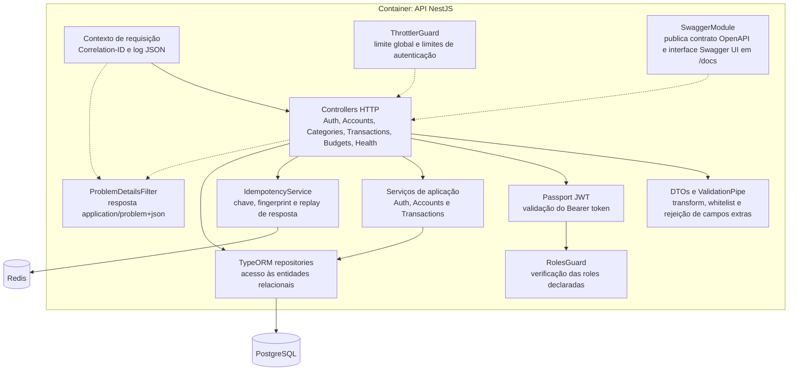
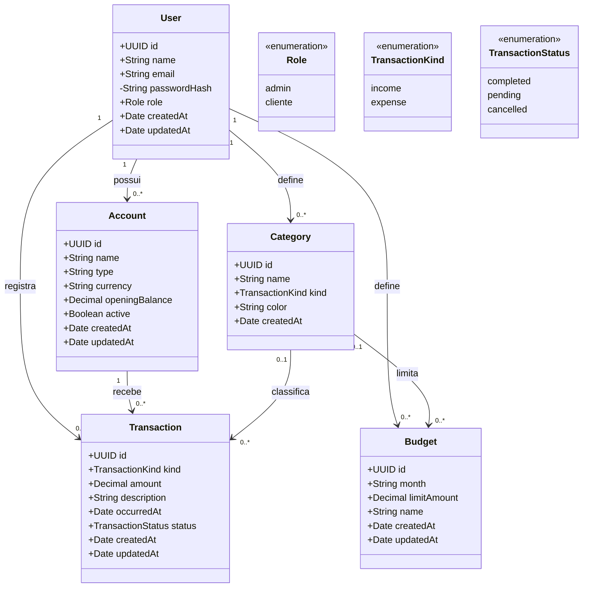

# Documentação arquitetural — API de Gestão Financeira

**Projeto:** API de Gestão Financeira  
**Versão do documento:** 1.0  
**Data:** 29/09/2026  
**Escopo:** processo de criação, arquitetura C4 (containers e componentes), modelo UML, decisões técnicas e requisitos não funcionais implementados.

## 1. Visão geral

A API permite que uma pessoa usuária gerencie contas financeiras, categorias, receitas e despesas, além de orçamentos mensais. O backend é uma aplicação REST construída em NestJS e TypeScript. PostgreSQL persiste os dados financeiros relacionais; Redis guarda o resultado temporário das operações idempotentes.

O trabalho foi organizado a partir dos requisitos do domínio e da avaliação: definir uma arquitetura, modelar as entidades, separar responsabilidades, expor um contrato HTTP documentado e empacotar o ambiente com Docker Compose. A arquitetura escolhida é **em camadas, modularizada por domínio**. A aplicação não é composta por microserviços: os módulos executam dentro de um único container da API.

## 2. Processo de criação

1. **Delimitação do domínio:** identificar usuários, autenticação, contas, categorias, transações e orçamentos como conceitos centrais da gestão financeira.
2. **Requisitos e casos de uso:** registrar usuário e entrar; manter os próprios dados financeiros; consultar transações por período; limitar acesso administrativo; evitar duplicação em criações repetidas.
3. **Modelagem:** desenhar entidades e relações antes de persistir. Identificadores UUID são usados nas entidades; valores monetários são `numeric(14,2)` no PostgreSQL; as entidades financeiras são associadas ao usuário proprietário.
4. **Escolha arquitetural:** separar entrada HTTP, regras de aplicação e adaptadores de persistência. Agrupar código por domínio para que cada área possa evoluir sem concentrar toda a lógica em um único módulo.
5. **Implementação:** controllers validam e encaminham as requisições; serviços aplicam regras de negócio; entidades TypeORM representam o modelo persistido; componentes comuns tratam autenticação, erros, contexto de requisição e idempotência.
6. **Requisitos transversais e contrato:** configurar JWT/RBAC, `Idempotency-Key`, Problem Details, logs JSON, throttling e Swagger/OpenAPI.
7. **Execução reproduzível:** Docker Compose inicia API, PostgreSQL e Redis, com health checks e volumes nomeados para os dados.

## 3. Arquitetura em camadas e módulos

| Camada | Responsabilidade | Código representativo |
| --- | --- | --- |
| Apresentação | Rotas HTTP, autenticação da requisição, DTOs e validação | `src/modules/*/*.controller.ts`, `src/modules/*/dto/` |
| Aplicação | Casos de uso e regras do domínio | `AuthService`, `TransactionsService`, `AccountsService` |
| Domínio/modelo | Entidades, atributos, vínculos e restrições | `*.entity.ts` em cada módulo |
| Infraestrutura | Banco relacional, cache/idempotência, configuração e runtime | TypeORM, PostgreSQL, Redis, NestJS e Docker |
| Transversal | Funções compartilhadas por vários casos de uso | `src/common/` — JWT/RBAC, ID de requisição, erros, idempotência |

Os módulos `auth`, `accounts`, `categories`, `transactions`, `budgets` e `health` mantêm os elementos de cada domínio próximos. O NestJS compõe controllers e providers por injeção de dependência. Os controllers de categorias e orçamentos acessam repositórios TypeORM diretamente; nos demais domínios, os serviços concentram as operações. Assim, o desenho é modular e em camadas, mas não impõe uma camada de domínio independente ou uma arquitetura hexagonal estrita.

## 4. C4 — Diagrama de contexto

O diagrama de contexto situa a API e seus usuários e sistemas externos.

## 5. C4 — Diagrama de containers

O limite de execução contém três containers de aplicação/infraestrutura. Swagger UI é servido pela própria aplicação NestJS, não é um container independente.

### Justificativa dos bancos

- **PostgreSQL:** usuários, contas, categorias, transações e orçamentos têm relações e restrições de integridade. O banco relacional permite chaves estrangeiras, índices e unicidade; `numeric(14,2)` representa valores monetários sem a imprecisão típica de ponto flutuante.
- **Redis:** a idempotência exige reivindicar uma chave atomicamente (`SET ... NX`), expirar registros após 24 horas e recuperar uma resposta anterior. Redis atende esse uso de baixa latência e os registros podem expirar. Não é a fonte principal dos dados financeiros.

## 6. C4 — Diagrama de componentes

## 7. UML — Diagrama de classes do modelo

As relações expressam propriedade dos dados por usuário. IDs de usuário e entidade são UUIDs no banco; propriedades de relação ManyToOne são materializadas como chaves estrangeiras pelo TypeORM.

### Restrições relevantes do modelo

- `users.email` é único; `passwordHash` não é selecionado por padrão nas consultas.
- Conta tem índice único composto por usuário e nome. Categoria tem índice único por usuário, nome e tipo. Orçamento tem unicidade por usuário, mês e categoria.
- Exclusão de usuário propaga para seus dados; transação impede exclusão da conta referenciada (`RESTRICT`); categoria removida é desassociada de transações e orçamentos (`SET NULL`).
- `amount`, `openingBalance` e `limitAmount` são `numeric(14,2)`. `month` é texto de 7 caracteres no formato ano-mês; a validação do formato é feita no DTO.
- `Account.type` é texto (valor padrão `checking`); tipos como `savings`, `cash` e `credit` são convenções, não enum PostgreSQL.

## 8. Requisitos não funcionais e comportamento

### Autenticação e autorização

Registro (`POST /api/v1/auth/register`) sempre atribui papel `cliente`; senha é armazenada com bcrypt. Login retorna JWT Bearer. Guard JWT protege rotas privadas; `RolesGuard` permite exigir papéis em rotas administrativas. O administrador inicial é criado a partir de `ADMIN_EMAIL` e `ADMIN_PASSWORD` durante a inicialização, caso ainda não exista, e a senha precisa ter pelo menos 12 caracteres. Há rota administrativa de listagem de usuários.

### Idempotência

Criações de conta, categoria, transação e orçamento requerem cabeçalho `Idempotency-Key` (1–128 caracteres permitidos). A chave é escopada por usuário e tipo de operação, e o corpo é identificado por SHA-256. A mesma chave e corpo reproduzem a resposta por 24 horas; chave reaproveitada com corpo diferente resulta em conflito HTTP 409. Chaves em processamento também resultam em 409. Indisponibilidade do Redis impede a operação, retornando erro de serviço indisponível, evitando criação sem garantia de idempotência.

### Tratamento global de erros

`ProblemDetailsFilter` captura exceções e responde com tipo `application/problem+json`, incluindo `type`, `title`, `status`, `detail`, `instance` e `requestId`. A estrutura segue o formato Problem Details associado à RFC 7807. O `requestId` corresponde ao contexto de correlação da requisição.

### Observabilidade básica

Middleware aceita `Correlation-ID` ou `X-Request-ID` válido (1–128 caracteres); se ausente ou inválido, gera UUID. Devolve `Correlation-ID` na resposta e emite log JSON no fim da requisição com timestamp, nível, ID, método, caminho, status e duração. Para observabilidade distribuída em nuvem, o mesmo cabeçalho deve ser encaminhado pelo gateway/load balancer.

### Controle de vazão

Throttler global limita a 100 requisições por minuto por padrão; registro e login limitam a 5 por minuto. O limite configurado usa armazenamento em memória do processo. Em múltiplas réplicas, cada instância aplica sua própria contagem; produção escalada requer armazenamento compartilhado (por exemplo Redis) ou política no API gateway.

### Contrato de API

O contrato OpenAPI é gerado a partir dos controllers e DTOs; a interface interativa Swagger UI, servida em `/docs`, permite consultar esse contrato e experimentar as rotas. O prefixo padrão das rotas é `/api/v1`. DTOs descrevem os campos e regras de validação. `ValidationPipe` valida e transforma as entradas e rejeita propriedades não declaradas.

### Infraestrutura como código e nuvem

`docker-compose.yml` define serviços da API, PostgreSQL e Redis, dependências condicionadas a health checks e volumes nomeados para persistência local. Inicialização: `docker compose up --build`. O Compose é infraestrutura reproduzível de desenvolvimento/demonstração; para nuvem, a API pode ser replicada atrás de balanceador e os bancos substituídos por serviços gerenciados. Migrações, backups, monitoramento/alertas, TLS/ingress, secrets manager e rate limit distribuído são configurações operacionais necessárias antes de produção. `DB_SYNCHRONIZE` deve ficar desabilitado em produção e ser substituído por migrações versionadas.

## 9. Fluxos principais

### Registrar transação

1. Cliente envia `POST /api/v1/transactions` com JWT, DTO e `Idempotency-Key`.
2. Middleware define o ID de correlação; Throttler avalia o limite; guard JWT valida identidade.
3. DTO é validado; controller chama o serviço idempotente com escopo do usuário e fingerprint do payload.
4. Redis reivindica a chave; serviço verifica se conta e categoria pertencem ao usuário e se o tipo de categoria combina com a transação.
5. TypeORM persiste a transação no PostgreSQL; Redis armazena e expira a resposta em 24 horas.
6. A resposta inclui o `Correlation-ID`; log estruturado é emitido. Exceções são transformadas em Problem Details.

### Iniciar o ambiente

Compose aguarda os health checks de PostgreSQL e Redis antes de iniciar a API. A API testa conectividade com PostgreSQL no endpoint `/api/v1/health`; Docker usa esse endpoint como health check do serviço.

## 10. Rotas implementadas

| Método e rota | Acesso | Idempotency-Key | Função |
| --- | --- | --- | --- |
| `POST /api/v1/auth/register` | Público; cria cliente | Não | Registrar usuário e obter token |
| `POST /api/v1/auth/login` | Público | Não | Autenticar e obter JWT |
| `GET /api/v1/auth/admin/users` | Admin | Não | Listar usuários sem hashes |
| `POST /api/v1/auth/admin/bootstrap` | Admin | Não | Verificar acesso administrativo |
| `GET /api/v1/health` | Público | Não | Verificar API e PostgreSQL |
| `GET/POST /api/v1/accounts` | JWT | POST sim | Consultar/criar contas |
| `DELETE /api/v1/accounts/:id` | JWT | Não | Remover conta própria |
| `GET/POST /api/v1/categories` | JWT | POST sim | Consultar/criar categorias |
| `GET/POST /api/v1/transactions` | JWT | POST sim | Consultar/criar transações |
| `DELETE /api/v1/transactions/:id` | JWT | Não | Remover transação própria |
| `GET/POST /api/v1/budgets` | JWT | POST sim | Consultar/criar orçamentos |

## 11. Execução local

1. Copie `.env.example` para `.env` e configure segredos adequados ao ambiente.
2. Execute `docker compose up --build`.
3. Consulte `http://localhost:3000/docs`, `http://localhost:3000/api/v1/health` e as rotas sob `/api/v1`.

## 12. Limites conhecidos e próximos passos

- A aplicação atualmente não implementa pagamento, integração bancária, atualização de saldo por evento nem refresh-token, apesar de existirem variáveis de ambiente reservadas a refresh. O domínio implementado é controle financeiro pessoal.
- As rotas privadas autenticam o usuário, e as consultas/alterações são filtradas pela propriedade. RBAC explícito é aplicado às rotas administrativas; usuários cliente não têm endpoints de administração.
- O throttle atual é local a cada instância. Configure backend Redis compartilhado ou gateway antes de escalar horizontalmente.
- Compose publica portas dos bancos para facilitar desenvolvimento. Restrinja/remova essas publicações fora de ambientes locais.
- Para operação em produção, adicionar migrações, política de backup e restauração, TLS, rotação de segredos, monitoramento/alertas e testes automatizados do comportamento crítico.

## 13. Referências do projeto

- `README.md` — introdução e comandos rápidos.
- `src/app.module.ts` e `src/main.ts` — composição, middlewares, validação e OpenAPI.
- `src/modules/*` — módulos, controladores, serviços, DTOs e entidades de domínio.
- `src/common/` — requisitos transversais.
- `Dockerfile` e `docker-compose.yml` — empacotamento e serviços locais.
